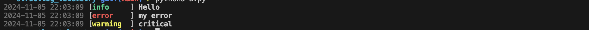

<div align="center">
<p align="center">

</p>

Structlog-Telemetry is a very simple custom Python structured logger library.
</div>

## Installation
```bash
python3 -m pip install -i https://test.pypi.org/simple/ structlog-telemetry==0.0.7
```

## Usage

```python
from structlog_telemetry.structured_logger import StructuredLogger

APP_NAME = "APP_X"
APP_VERSION = "v0.0.1"
logger = StructuredLogger(APP_NAME, APP_VERSION)


logger.info({"KEY_NOT_FOUND": "SEARCHED_KEY"})
logger.warning({"LATENCY": "30"})
logger.error({"SERVER_TIMEOUT": {"SERVER": "test.com", "TIMED_OUT_AFTER": 10}})
```



Next Steps: update the workflow
push -> build -> push to pypi test -> create release
merge release -> build -> push to pypi
